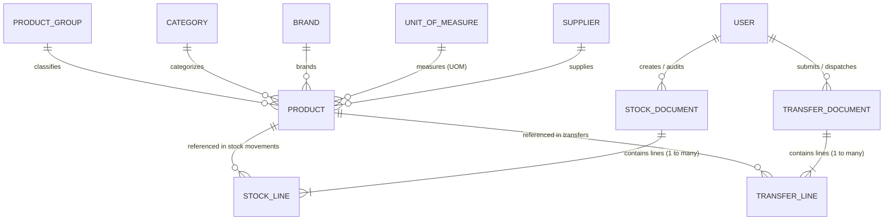
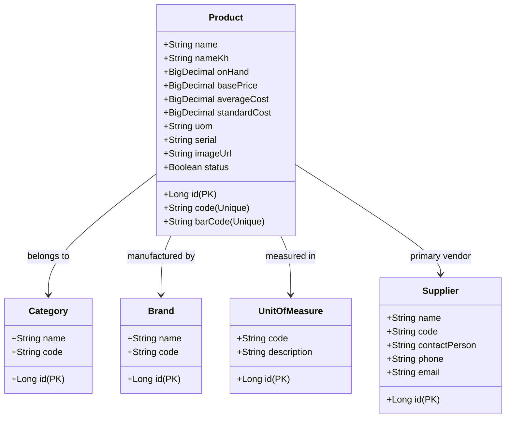
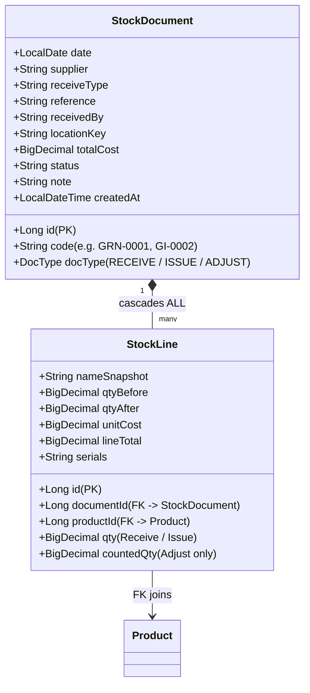
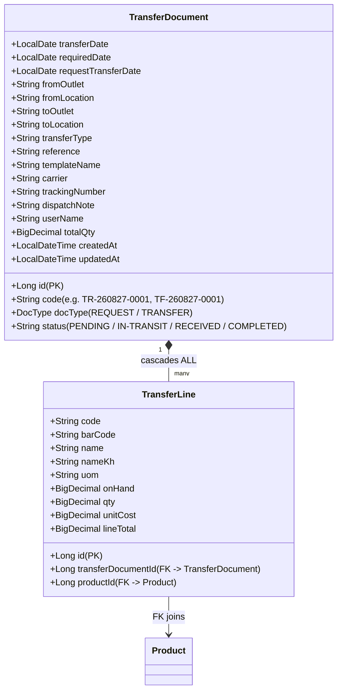
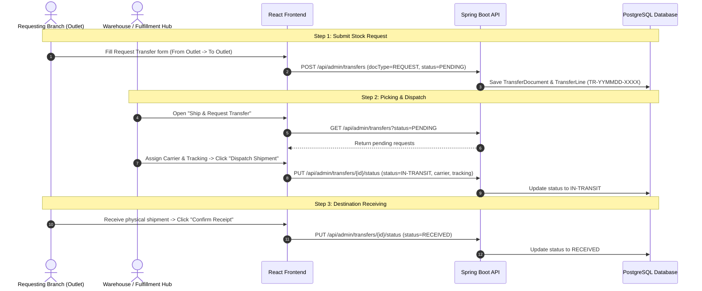

# Inventory & Stock System: Data Relationship & Architecture Guide

This document explains the complete **Data Model, Entity Relationships, Database Schema, and Transaction Lifecycles** powering the B'Groceries Inventory & Stock Management System across the Spring Boot backend and React frontend.

---

## 1. High-Level Entity Relationship Diagram (ERD)

---

## 2. Core Entities & Schema Details

### 2.1 Master Data Layer (Catalog & Attributes)

- **`Product` (`product` table)**: The central catalog entity. Every stock quantity (`onHand`), selling price (`basePrice`), and cost basis (`averageCost`) lives here.
- **`UnitOfMeasure` (`unit_of_measure` table)**: Defines inventory units (`Kg`, `Pcs`, `Pack`, `Bottle`, `Box`).
- **`Supplier` (`supplier` table)**: Links products with commercial vendors for replenishment and PO tracking.

---

### 2.2 Stock Transaction Layer (Receive, Issue, Adjust)

#### How the Relationships Work:
1. **Document-Line Composition (`1:N`)**: A `StockDocument` owns multiple `StockLine` items. Deleting a document automatically cascades and removes its lines.
2. **Audit Snapshots**:
   - `nameSnapshot`: Retains the product name as it was on the document date, even if the product is later renamed.
   - `qtyBefore` & `qtyAfter`: Captures the exact inventory balance before and after the transaction for auditable history.
3. **Foreign Key Integrity**: Every line holds a physical `@ManyToOne` foreign key to `Product`. This guarantees that on-hand counts and ledgers never get out of sync.

---

### 2.3 Stock Transfer & Logistics Layer

---

## 3. Stock Movement & Cost Calculation Mechanics

### 3.1 Goods Receipt (`DocType.RECEIVE`)
When receiving new inventory from suppliers:
1. **On-Hand Increase**:
   $$\text{onHand}_{\text{new}} = \text{onHand}_{\text{old}} + \text{qty}_{\text{received}}$$
2. **Moving Average Cost (MAC) Formula**:
   $$\text{averageCost}_{\text{new}} = \frac{(\text{onHand}_{\text{old}} \times \text{averageCost}_{\text{old}}) + (\text{qty}_{\text{received}} \times \text{unitCost}_{\text{received}})}{\text{onHand}_{\text{old}} + \text{qty}_{\text{received}}}$$

### 3.2 Goods Issue (`DocType.ISSUE`)
When issuing stock for internal consumption, samples, or write-offs:
1. **On-Hand Deduction**:
   $$\text{onHand}_{\text{new}} = \text{onHand}_{\text{old}} - \text{qty}_{\text{issued}}$$
2. Cost basis remains unchanged (`averageCost` is preserved).

### 3.3 Inventory Adjustment (`DocType.ADJUST`)
When physical inventory counts differ from system quantities:
1. **Reconciliation**:
   $$\text{onHand}_{\text{new}} = \text{countedQty}$$
   $$\text{diff} = \text{countedQty} - \text{onHand}_{\text{old}}$$

### 3.4 Document Reversal on Delete
If a `StockDocument` is deleted via `DELETE /api/admin/stock-documents/{id}`:
- `RECEIVE` documents automatically deduct the received quantities.
- `ISSUE` documents automatically restore the issued quantities.
- `ADJUST` documents revert `onHand` back to `qtyBefore`.

---

## 4. Stock Transfer Lifecycle Workflow

---

## 5. Frontend Pages to Backend REST APIs Mapping

| Frontend Page / Component | Action | Backend REST Endpoint | Database Entity |
| :--- | :--- | :--- | :--- |
| **All Products** (`StocksList.jsx`) | View Catalog | `GET /api/admin/products` | `Product` |
| **Receive Products** (`ReceiveProductsCreate.jsx`) | Post Receipt | `POST /api/admin/stock-documents` | `StockDocument` + `StockLine` |
| **Receive Products List** (`TransactionSection.jsx`) | View & Export Ledgers | `GET /api/admin/stock-documents?docType=RECEIVE` | `StockDocument` |
| **Issue Products** (`TransactionDocCreate.jsx`) | Deduct Stock | `POST /api/admin/stock-documents` | `StockDocument` + `StockLine` |
| **Adjustment Products** (`TransactionDocCreate.jsx`) | Reconcile Counts | `POST /api/admin/stock-documents` | `StockDocument` + `StockLine` |
| **Request Transfer** (`RequestTransferCreate.jsx`) | Create Request | `POST /api/admin/transfers` | `TransferDocument` + `TransferLine` |
| **Request Transfer List** (`RequestTransferSection.jsx`) | Filter & Delete | `GET /api/admin/transfers?docType=REQUEST` | `TransferDocument` |
| **Ship & Request Transfer** (`ShipRequestTransferSection.jsx`) | Dispatch / Bulk Ship | `PUT /api/admin/transfers/{id}/status` `POST /api/admin/transfers/ship-bulk` | `TransferDocument` |
| **Transfer Products** (`TransferProductsCreate.jsx`) | Direct Transfer | `POST /api/admin/transfers` | `TransferDocument` + `TransferLine` |
| **Products Prices** (`ToolsSection.jsx`) | Update Selling Prices | `PUT /api/admin/products/{id}` | `Product` (`basePrice`) |
| **Cost Change** (`ToolsSection.jsx`) | Batch Cost Adjustments | `PUT /api/admin/products/{id}` | `Product` (`averageCost`) |
| **Products Supplier** (`ToolsSection.jsx`) | Map Vendors | `PUT /api/admin/products/{id}` | `Product` (`supplier`) |
| **Master Data** (`MasterDataSection.jsx`) | Manage Categories, Brands, UOMs | `GET/POST/PUT/DELETE /api/admin/{categories,brands,units}` | `Category`, `Brand`, `UnitOfMeasure` |
